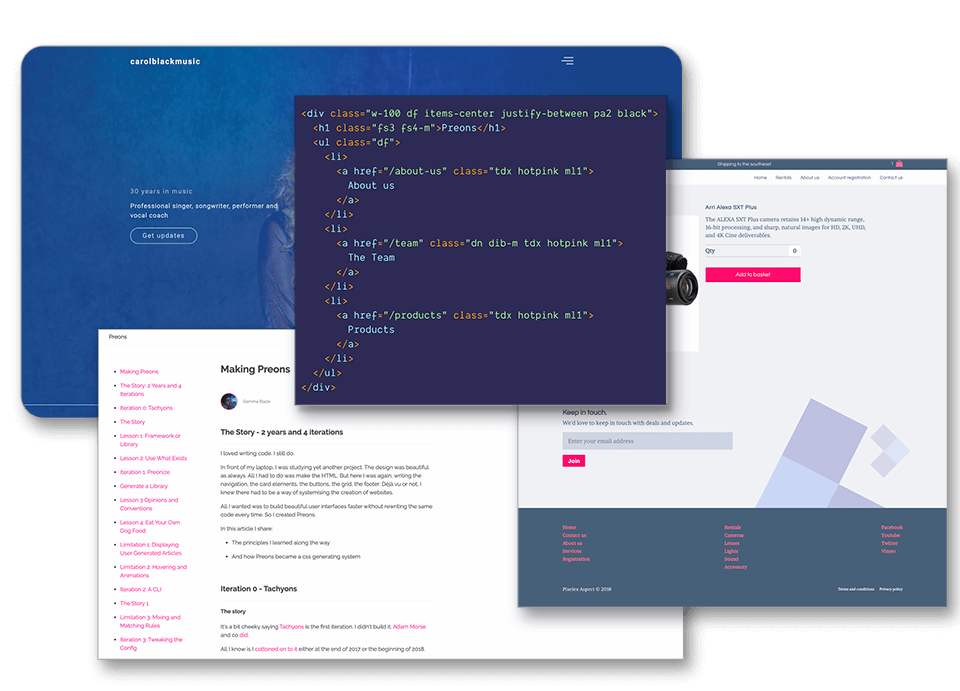

# Preons 🛰

[](https://app.codacy.com/gh/preons/preons?utm_source=github.com&utm_medium=referral&utm_content=preons/preons&utm_campaign=Badge_Grade)
[](https://travis-ci.com/preons/preons)

A functional CSS system for building user interfaces 🛰

[Documentation](#-documentation) | [CLI](#-cli) | [Reference](#-reference)



## 🔬Currently Under Development

This repo is subject to lots of changes as it's in prime experimental mode. See _going from [0.0.0 to 1.0.0](/docs/notes/2020-05.md#experimental-mode)_.

## 🚀 Documentation

Get started [here](https://www.preons.co/learn).

## 💠 Themes

Coming soon

## 💻 CLI

Learn more [here](https://www.preons.co/learn/cli/installation).

## 🗒 Configuration

Example [preons.yaml](/config/preons.yaml).

Read the docs [here](https://preons.co/learn/cli/generate).

## Preonize Function

The `preonize` function is currently an `scss` function. It allows Preons to generate lots of rules at multiple breakpoints without having to hardcode each CSS class.

It has 4 parameters.

```plain
@include preonize(
  <class name>,       # The prefix name of the class eg. 'h' for height
  <css property>,     # The css property assigned to the class 'height'
  <sass map rules>,   # Sass map of rules eg. (1: 1rem, 2: 2rem)
  <breakpoints>       # Breakpoints
);
```

Thus, we can reuse different sass-maps for several rules. Here's an example use:

```scss
@include preonize(
    "h",
    width,
    map-collection(scaled, percentaged, discrete, special-sizes),
    $breakpoints
);
```

## 📚 Reference

Look up the reference [here](https://preons.netlify.app/search) or peruse them below.

## 🗺️ Roadmap

Read the roadmap [here](https://preons.co/articles/roadmap).

## ⛓ Versioning

This project uses [SemVer](http://semver.org/) for versioning and [Intuit's Auto](https://intuit.github.io/auto/) to generate releases on the fly. For the versions available, see the [tags on this repository](https://github.com/preons/preons/tags).

## 🙌 Thank yous

-   [Intuit's Auto](https://intuit.github.io/auto/) for making releases easier
-   [Adam Moore & Tachyons](https://tachyons.io/) for creating their wonderful library

## Contributing

Thank you for your desire to contribute. All you have to do is create a PR. Note the following conventions:

-   This project uses [Angular commit conventions](https://github.com/conventional-changelog/commitlint/tree/master/@commitlint/config-angular). As it's in version experimental, prefix your commits with `fix: `.

## 🔖 Licence

You are free to modify and do as you choose to this library however, it uses [GPLv2.1](#LICENSE) to keep it free for all into the future. Of course, you can commercialize your product where this library is part of a larger piece of work and is merely a dependency.

Here's a really helpful video explanation of GPL licences in general.

https://www.youtube.com/watch?v=JlIrSMzF8T4

## Contributors ✨

Thanks goes to these wonderful people ([emoji key](https://allcontributors.org/docs/en/emoji-key)):

<!-- ALL-CONTRIBUTORS-LIST:START - Do not remove or modify this section -->
<!-- prettier-ignore-start -->
<!-- markdownlint-disable -->
<table>
  <tr>
    <td align="center"><a href="http://getrentr.com"><br /><sub><b>Gemma Black</b></sub></a><br /><a href="https://github.com/preons/preons/commits?author=gemmadlou" title="Documentation">📖</a> <a href="https://github.com/preons/preons/commits?author=gemmadlou" title="Code">💻</a> <a href="https://github.com/preons/preons/commits?author=gemmadlou" title="Tests">⚠️</a> <a href="#infra-gemmadlou" title="Infrastructure (Hosting, Build-Tools, etc)">🚇</a></td>
    <td align="center"><a href="https://github.com/pgrimaud"><br /><sub><b>Pierre Grimaud</b></sub></a><br /><a href="https://github.com/preons/preons/commits?author=pgrimaud" title="Documentation">📖</a></td>
    <td align="center"><a href="https://fabiorosado.dev/"><br /><sub><b>Fábio Rosado</b></sub></a><br /><a href="https://github.com/preons/preons/commits?author=FabioRosado" title="Code">💻</a></td>
  </tr>
</table>

<!-- markdownlint-restore -->
<!-- prettier-ignore-end -->

<!-- ALL-CONTRIBUTORS-LIST:END -->

This project follows the [all-contributors](https://github.com/all-contributors/all-contributors) specification. Contributions of any kind welcome!
